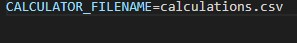
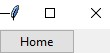
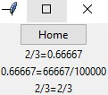

# Käyttöohje
Hae ja lataa projektin viimeisin versio [Release]() Assets osion Source code kohdasta.

## Konfigurointi
Tallennusta varten käytettävä tiedosto on .env tiedostossa juurihakemistossa. Jos tiedostoja ei ole valmiiksi ole, niin ohjelma luo ne automaattisesti data-hakemistoon. Tiedosto on muotoa:



## Ohjelman käynnistäminen
Aluksi lataa ohjelman riippuudet syöttämällä komentoriville käsky
```bash
poetry install
```
Nyt ohjelman pystyy käynnistämään komentoriviltä komennolla
```bash
poetry run invoke start
```
## Alkunäkymä
Ohjelma käynnistyy alkunäkymään, missä on 5 nappia. Exit-näppäin, Calculator-näppäin, Setting-näppäin, History-näpppäin ja Clear history-näppäin. Calculator-näppäin vie laskimeen, Settings-näppäin asetuksiin ja History-näppäin laskuhistoriaan. Clear history-näppäin tyhjentää laskuhistorian. 


## Laskinnäkymä


Laskinnäkymässä on paljon erilaisia nappeja numero näppäimiä, laskutoimitus näppäimiä ja Home näppäin, jolla pääsee takaisin alkunäkymään.
### Laskimenkäyttö
Painamlla numero näppäimiä ohjelma kirjoittaa laskettavaa lauseketta. Lopuksi painamalla "=" näppäintä, ohjelma laskee kirjoitetun lausekkeen.


Suurin osa laskimen laskimen näppäimistä näyttää tutuilta muistakin laskimista. AC-näppäin tyhjentää lausekkeen, x** on potenssimerkki, sqrt() on neliöjuuri, ans on edellisen laskun vastaus, factorial() on kertoma, "()" lisää tasoittavan sulkumerkin jne... Lausekkeessa pitää olla tasamäärä sulkeita, eli pitää olla yhtä monta vasenta ja oikeaa sulkumerkkiä "(",")". Jos ei ole niin laskin palauttaa errorin.

## Asetuksetnäkymä


### Asetuksien säätämistä
Painamalla Increase- tai Decrease round nappeja ohjelman pyöristys tarkkuus laskee tai nousee. Defaulta round muutttaa pyöristyksen takaisin alkuperäiseksi. Form-näppäin muuttaa, missä muodossa ohjelma laskee lausekkeet. Jos näkymässä lukee "Decmal" niin vastaukset annetaan desimaaleina ja jos lukee "Fraction" niin vastaukset tulee murtolukuina.


## Laskuhistorianäkymä

Laskuhistoria on tyhjä jos katsot sinne heti ensimmäisen käynnistyksen jälkeen, koska et ole vielä ehtinyt laskea mitään. Laskettuasi laskuja niin laskuhistoriaan alkaa ilmestymään lausekkeita.





