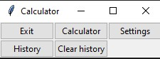
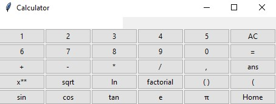
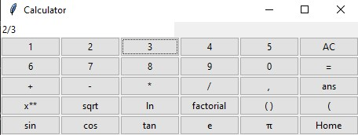
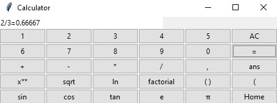
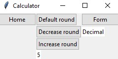
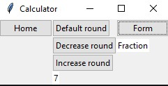

# Käyttöohje
Lataa projektin viimeisen versio [releasen]() Asset osion alta kohdasta Source code.

## Ohjelman käynnistäminen
Aluksi lataa ohjelman riippuudet syöttämällä komentoriville käsky
```bash
poetry install
```
Nyt ohjelman pystyy käynnistämään komentoriviltä komennolla
```bash
poetry run invoke start
```
## Alkunäkymä
Ohjelma käynnistyy alkunäkymään, missä on kolme nappia. Exit-näppäin, Calculator-näppäin ja Setting-näppäin.



## Laskinnäkymä
Jos alkunäkymässä painaa Calculator-nappia niin pääsee itse laskimeen.



Laskinnäkymässä on paljon erilaisia nappeja numero näppäimiä, operaattori näppäimiä ja Home näppäin, jolla pääsee takaisin alkunäkymään.
### Laskimenkäyttö
Painamlla numero näppäimiä ohjelma kirjoittaa laskettavaa lauseketta. Lopuksi painamalla "=" näppäintä, ohjelma laskee kirjoitetun lausekkeen.





Laskinnäkymässä on monia näppäimiä. Suurin osa näyttää tutuilta muistakin laskimista. AC-näppäin tyhjentää lausekkeen, x** on potenssimerkki, sqrt() on neliöjuuri jne...
## Asetuksetnäkymä
Jos alkunäkymässä painaa Setting-näppäintä niin pääsee ohjelman asetuksiin.



### Asetuksien säätämistä
Painamalla Increase- tai Decrease round nappeja ohjelman pyöristys tarkkuus laskee tai nousee. Defaulta round muutttaa pyöristyksen takaisin alkuperäiseksi. Form-näppäin muuttaa, missä muodossa ohjelma laskee lausekkeet. Jos näkymässä lukee "Decmal" niin vastaukset annetaan desimaaleina ja jos lukee "Fraction" niin vastaukset tulee murtolukuina.


