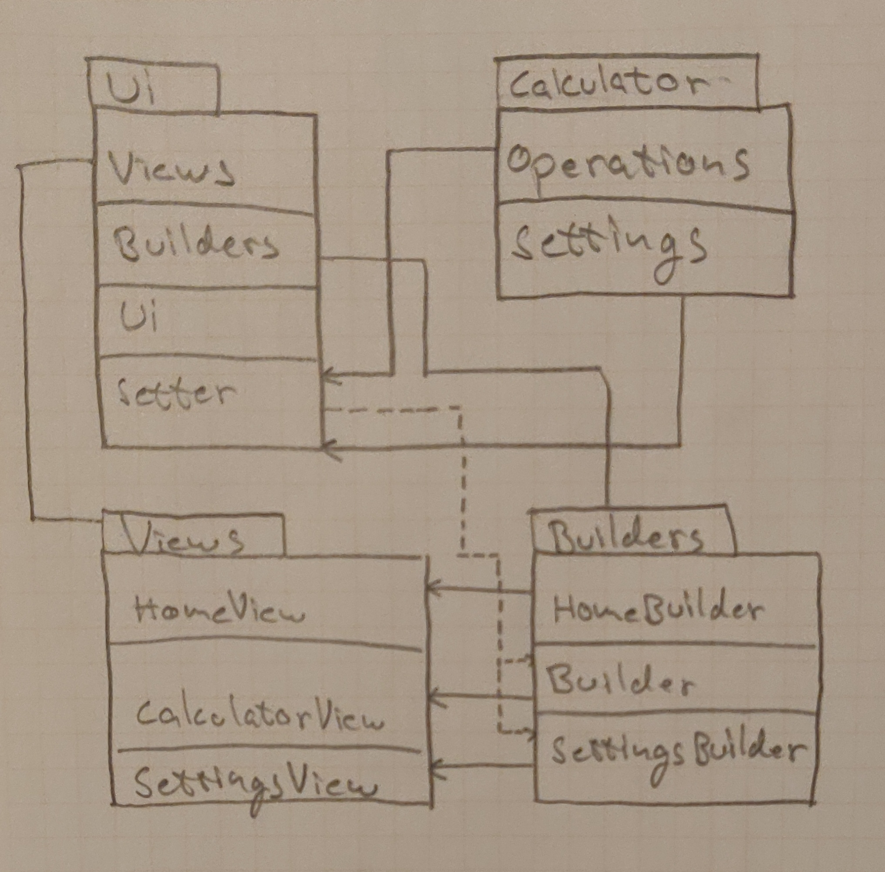

# Arkkitehtuurikuvaus

## Rakenne
Ohjelman rakenne noudattaa kolmetasoista kerrosarkkitehtuuria ja koodin pakkausrakenne on seuraava:

Pakkaus Ui sisältää kaiken käyttöliittymään sisältyvän koodin sekä käyttöliittymän ja sovelluslogikan yhdistävän luokan Setter. Pakkaus Calculator sisältää sovelluslogiikan koodin. Pakkaus repository sisältää tiedon lukemiseen ja tallentamiseen liittyvän koodin.
## Käyttöliittymä
Käyttöliittymässä on neljä mahdollista näkymää:
- Alkunäkymä
- Laskinnäkymä
- Asetuksetnäkymä
- Historianäkymä

Jokainen näkymä on totetuettu omassa luokassaan, joista kerrallaan on yksi näkyvillä. [Ui](https://github.com/TuomasVaara/ot-harjoitustyo/blob/master/src/ui/ui.py) luokka vastaa näkymien näyttämisesta. Käyttöliittymän näkymät on eristetty itse sovelluslogiikasta. Sovelluslogiikan ja käyttöliittymän kommunikoinnin hoitaa [Setter](https://github.com/TuomasVaara/ot-harjoitustyo/blob/master/src/ui/setter.py) luokka.
Luokkakaavio ohjelmasta

## Sovelluslogiikka

Sovelluslogiikan toteuttavat luokat [Operations](https://github.com/TuomasVaara/ot-harjoitustyo/blob/master/src/calculator/operations.py) ja [Settings](https://github.com/TuomasVaara/ot-harjoitustyo/blob/master/src/calculator/settings.py). [Setter](https://github.com/TuomasVaara/ot-harjoitustyo/blob/master/src/ui/setter.py) luokasta kutsutaan sovelluslogiikan luokkia. 

## Päätoiminnallisuudet
Kuvataan vielä pari ohjelman päätoiminnallisuutta sekvenssikaaviona.

### Desimaalin kasvattaminen

Sekvenssikaavio kuvaa mitä tapahtuu, kun asetuksetnäkymässä painaa Increse round nappia. Ensin kutsutaan Setter luokkaa, joka kutsuu Settings luokan oliota. Tämän jälkeen setter luokan olio muuttaa käyttöliittymän muuttuvan Stringvar olion ja kutsuu operations oliota ja muuttaa pyöristys tarkkuuden.

### Laskun syöttäminen yksinkertaistettuna ja laskeminen

Tämä sekvenssikaavio kuvaa mitä tapahtuu, kun laskinnäkymässä painaa "=" nappia. Aluksi kutsutaan setter oliota, joka kutsuu operations oliota. Operations olio yrittää laskea nykyisen lausekkeen, joka on tässä tapauksessa tyhjä lauseke. Koska lauseke on tyhjä, niin operations olio palauttaa merkkijonon "0=0" ja kutsuu calculatorrepository oliota tallentamaan laskun tietokantaan.

