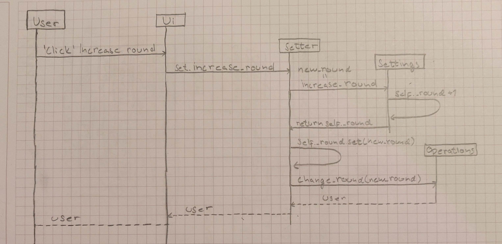
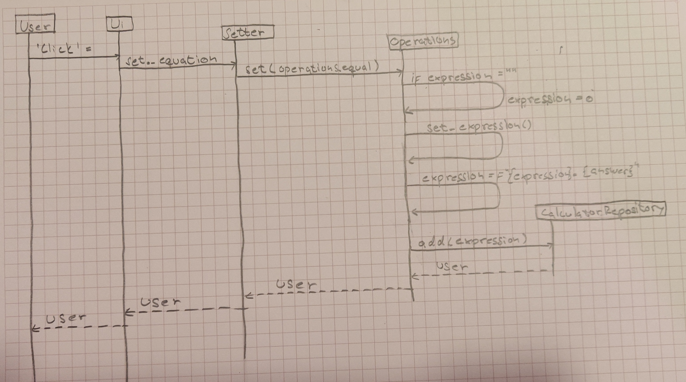

# Arkkitehtuurikuvaus

## Rakenne
Ohjelman rakenne noudattaa kaksitasoista kerrosarkkitehtuuria ja koodin pakkausrakenne on seuraava:

Pakkaus Ui sisältää kaiken käyttöliittymään sisältyvän koodin sekä käyttöliittymän ja sovelluslogikan yhdistävän luokan Setter. Pakkaus Calculator sisältää sovelluslogiikan koodin.
## Käyttöliittymä
Käyttöliittymässä on kolme mahdollista näkymää:
- Alkunäkymä
- Laskinnäkymä
- Asetuksetnäkymä
Jokainen näkymä on totetuettu omassa luokassaan, joista kerrallaan on yksi näkyvillä. [Ui]() luokka vastaa näkymien näyttämisesta. Käyttöliittymän näkymät on eristetty itse sovelluslogiikasta. Sovelluslogiikan ja käyttöliittymän kommunikoinnin hoitaa [Setter]() luokka.

## Sovelluslogiikka

Sovelluslogiikan toteuttavat luokat [Operations]() ja [Settings](). [Setter]() luokasta kutsutaan sovelluslogiikan luokkia. 

## Päätoiminnallisuudet
Kuvataan vielä pari ohjelman päätoiminnallisuutta sekvenssikaaviona.

### Desimaalin kasvattaminen

Kun ohjelman alkunäkymästä painetaan nappia Settings päästään asetuksetnäkymään. Kun painaa Increase round näppäinta niin ohjelman pyöristys tarkkuus nousee yhdellä.

### Laskun syöttäminen yksinkertaistettuna ja laskeminen

Kun ohjelman alkunäkymästä painetaan nappia Calculator päästään laskinnäkymään. Kun painetaan numero näppäimiä ja operaattoreita saadaan muodostettua lauseke. Lopuksi painamalla "=" nappia niin ohjelma laskee annetun lausekkeen.

