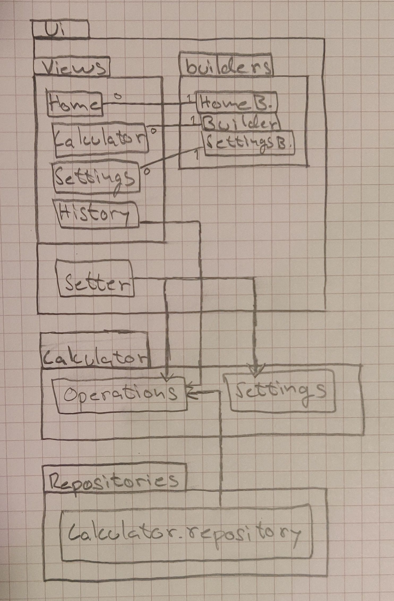

# Arkkitehtuurikuvaus

## Rakenne
Pakkauskaavio sisältää 2 alihakemistoa: ui ja calculator. Alihakemisto ui sisältää käyttöliittymän koodin ja calculator sovelluslogiikan. Alihakemiston ui koodi on jaettu views ja builders alihakemistoihin.

Luokkakaaviossa näkyy eri luokat, jotka rakentavat käyttöliittymän. Builder luokat yhdistävät käyttöliittymään sovelluslogiikan.

Sekvenssikaavio kuvaa miten sovelluksen alkunäkymästä siirrytään laskintilaan ja mitä numeronäppäimen painalluksessa tapahtuu.

