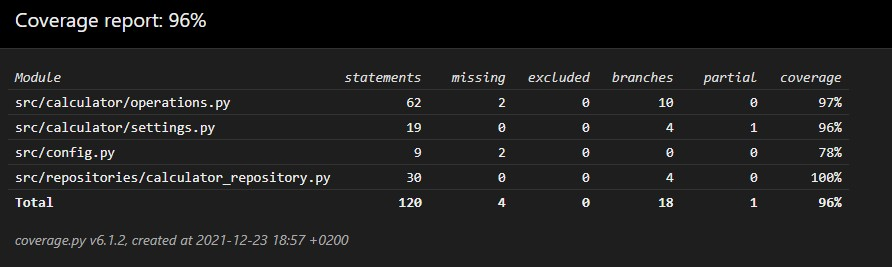

# Testausdokumentti
Ohjelmaa on testattu automatisoiduilla unittesteilla ja järjestelmää manuaalisesti.

## Automatisoidut testit

### Sovelluslogiikka

Sovelluslogiikan luokka Operations testataan TestOperations-luokalla. Testi luokka alustetaan Operations-luokan oliolla. Sovelluslogiikan luokka Settings testataan TestSettings-luokalla. Testi luokassa alustetaan Operations- ja Settings-luokan oliot. 

### Repositorio-luokka

Repositorio-luokka CalculatorRepository testataan testeissä käytössä olevalla tiedostalla. Tiedoston nimi on konfiguroitu .env.test-tiedostoon. CalculatorRepository-luokka testataan TestCalculatorRepository-testiluokalla.

### Testauskattavuus

Sovelluksen testikattavuuden haarautuminen on 96% sovelluslogiikan ja repositoryn osalta. 

## Järjestelmätestaus

#### Toiminnallisuudet

[Vaatimusmäärittely](https://github.com/TuomasVaara/ot-harjoitustyo/blob/master/Dokumentaatio/Vaatimusm%C3%A4%C3%A4rittely.md) dokumentissa mainitut toiminnallisuudet on testattu. 

